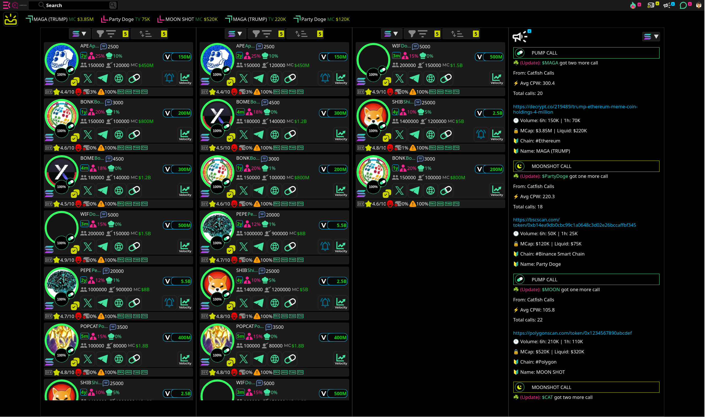

# Meme Trader


**Real-time, multi-view meme coin trading terminal designed for speed and comprehensive data visualization.**

Meme Trader is  aimed at providing meme coin traders with a significant informational advantage. In the fast-paced world of meme coin trading, speed and access to immediate, relevant data are paramount. This tool is engineered to deliver a high-speed, information-dense interface that allows traders to monitor, filter, and react to market changes with unparalleled efficiency.

## Key Features

Primary goal is to present all critical information on a single, intuitive screen, minimizing the need for multiple tabs or platforms.

### 1. Information-Dense Dashboard


Each listed token provides a wealth of at-a-glance information:

*   **Token Info:** Name, symbol, and age (e.g., 2y, 1y, 4m).
*   **Key Metrics:**
    *   **Developer Holding:** Percentage of tokens held by the developer.
    *   **Liquidity Info:** A clear indicator of the liquidity pool status.
    *   **Holders:** Total number of individual token holders.
    *   **Market Cap (MC):** Current market capitalization.
    *   **Volume (V):** Trading volume over a specific period.
*   **Social & Contract Links:** Direct links to the token's social media (like X/Twitter and Telegram), website, and contract address.
*   **Trust & Safety:**
    *   **DEV Rating:** A star rating (e.g., 4.4/10) to quickly assess developer credibility.
    *   **Security Audits:** Indicators for security aspects like `DEX`, `ADS`, `TrNd`, `CTO`.
*   **Real-time Velocity:** A graph icon indicating the trading velocity or momentum of the token.

### 2. Multi-Column Layout

One of the standout features is the ability to have up to three independently filtered and sorted columns. This allows you to:

*   Monitor newly launched tokens in one column.
*   Track your current holdings or a watchlist in another.
*   Keep an eye on top-gaining tokens based on market cap or volume in a third.

This multi-faceted view is designed to give you a comprehensive perspective of the market without ever leaving the main screen.

### 3. Advanced Filtering & Sorting


Tailor your view to your exact needs with a robust set of filters and sorting options:

*   **Token Filters:**
    *   Filter by platform or launchpad (e.g., Pump.Fun, MoonShot).
    *   Select token maturity (e.g., Graduated, Top 10 Holder).
    *   Include or exclude tokens based on social presence.
*   **Real-Time Refresh Rate:** Adjust the data refresh rate to as low as 1 second for the most up-to-the-minute information.
*   **Metric-Based Filtering:** Set min/max values for:
    *   Volume (Buy/Sell)
    *   Transactions (TXNS)
    *   Market Cap & Liquidity
    *   Bond Curve %
    *   Dev Holding %
    *   Number of Holders
*   **Sorting Options:** Sort any column in ascending or descending order based on any of the key metrics available.

### 4. Customizable Alarms


Stay ahead of market movements with customizable alarms. You can set up notifications based on:

*   **Market Cap Movement:** Get alerted when a token's market cap moves up or down by a specified amount or percentage.
*   **(Upcoming) Other Triggers:** Future updates will include alarms for volume, liquidity changes, and more.

## Getting Started
1.  **Clone the repository:**
2.  **Install dependencies:**
    ```bash
    npm install
    ```
3.  **Run the application:**
    ```bash
    npm start
    ```
